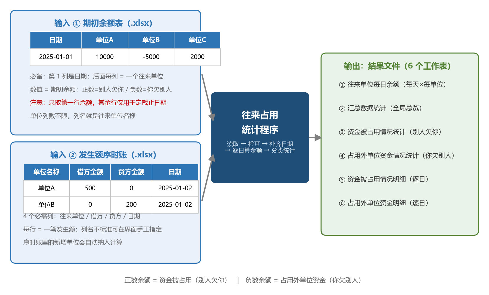

# 📘 往来占用统计工具使用说明

> 版本：v2.0.7
> 最后更新：2026年8月9日

---

## 🎯 这是什么工具？

一句话说明：这是一个帮你把“往来余额”和“每天的资金占用情况”自动整理出来的工具。

你只需要准备两份电子表格：

1. 一份期初余额表
2. 一份发生额序时账

然后按界面提示选好文件、选好工作表、选好列名，程序就会自动帮你做下面这些事情：

1. 📖 读取两份表里的数据
2. 🧹 检查日期和金额格式
3. 📅 按天补齐完整日期
4. 🧮 把每天的往来余额自动算出来
5. 💰 分清楚“别人占用你的资金”和“你占用别人的资金”
6. 📊 生成汇总表和明细表
7. 📁 导出成新的结果文件

如果你不会写公式、不会做透视表、不会写程序，也没关系。

这个工具本来就是为了让普通财务人员、审计人员、分析人员，拿到文件就能直接处理而准备的。

---

## 👥 适合谁用？

| 人群 | 适合拿它做什么 |
|------|----------------|
| 👩‍💼 财务人员 | 快速整理往来余额，判断哪些单位长期占用资金 |
| 🧾 审计人员 | 快速看被审计单位往来款项是否异常、金额是否长期挂账 |
| 📈 财务分析人员 | 看资金被谁占用、占用了多久、平均占用多少 |
| 🏢 经营管理人员 | 了解哪些单位回款慢，哪些往来长期没有清掉 |
| 🧠 不懂技术的人 | 不用自己写公式，直接点按钮就能得到结果 |

---

## 🚀 三步上手

### 第一步：打开程序

在命令窗口进入程序所在文件夹后，用下面两种方式之一启动：

1. ⌨️ `python main.py`
2. ⌨️ `python -m 往来占用统计.main`（在程序文件夹的上一级目录运行）

程序启动后会弹出图形界面，后续操作都在界面上完成，不需要再碰命令行。

### 第二步：选择两份文件，再选对应内容

打开界面后，你主要需要做四件事：

1. 选择发生额序时账文件
2. 选择期初余额表文件
3. 分别选好这两个文件对应的工作表
4. 在下拉框里告诉程序哪一列是往来单位、哪一列是借方、哪一列是贷方、哪一列是日期

### 第三步：点击开始处理，等结果出来

点了开始处理以后，你不用再手工算。

程序会自动读取、整理、计算、导出。

处理完成后，会在原文件附近生成一个新的结果文件，你直接打开看结果就可以了。

---

## 📁 你需要准备什么？

这个工具必须要两份电子表格，少一份都不行。

### 🖼️ 一张图看懂输入和输出

### ✅ 必需列清单一览

| 文件 | 必需内容 | 说明 |
|------|----------|------|
| 期初余额表 | 第 1 列：日期 | 分析起始日（期初那一天） |
| 期初余额表 | 第 2 列起：每个往来单位一列 | 列名就是单位名称，数值是期初余额；单位数量不限 |
| 发生额序时账 | 往来单位列 | 每行一笔发生额对应的单位名称 |
| 发生额序时账 | 借方金额列 | 数字，空白或非数字按 0 处理 |
| 发生额序时账 | 贷方金额列 | 数字，空白或非数字按 0 处理 |
| 发生额序时账 | 日期列 | 该笔发生额的记账日期 |

### 📄 文件一：期初余额表

这份表是“每天余额”的起点。

你可以把它理解成：程序先看你最开始那一天，每个往来单位余额是多少，然后再把后面的每天交易一笔一笔叠加上去，最终算出每天的余额变化。

### 期初余额表最基本的样子

期初余额表通常只需要一行数据 —— 即分析期初（第一天）各往来单位的余额。

| 日期 | 单位A | 单位B | 单位C |
|------|------|------|------|
| 1月1日 | 10000 | -5000 | 2000 |

> ⚠️ **重要：如果你的余额表有多行，程序只取第一行的余额值作为期初余额。**
> 其余行仅用于确定分析截止日期，余额值不会参与计算。如果你需要提供每天的累计余额，
> 请只保留第一行，然后让程序根据序时账自动计算后续每天的余额变化。

### 这份表要注意什么？

1. 第一列必须是日期
2. 后面每一列通常代表一个往来单位
3. 单元格里的数字是第一天的起始余额
4. 正数表示别人欠你钱（期初别人占用你的资金）
5. 负数表示你欠别人钱（期初你占用外单位资金）

### 这句话一定要看懂

1. 正数：资金被占用，也就是别人占用了你的资金
2. 负数：占用外单位资金，也就是你占用了别人的资金

比如：

1. 单位A 是 10000，意思是单位A 欠你一万元
2. 单位B 是 -5000，意思是你欠单位B 五千元

### 📄 文件二：发生额序时账

这份表是“每天发生了什么交易”的明细。

你可以把它理解成：期初余额表告诉程序“起点是多少”，序时账告诉程序“后面每天变动了多少”。

### 序时账最基本的样子

| 单位名称 | 借方金额 | 贷方金额 | 日期 |
|----------|----------|----------|------|
| 单位A | 500 | 0 | 1月2日 |
| 单位B | 0 | 200 | 1月2日 |
| 单位A | 300 | 0 | 1月3日 |
| 单位C | 0 | 100 | 1月3日 |

### 这份表要注意什么？

1. 必须能找到“单位名称”这一类列
2. 必须能找到“借方金额”和“贷方金额”这两类列
3. 必须能找到“日期”这一类列
4. 每一行表示一笔发生额

### 列名不完全一样怎么办？

没关系。

程序本来就考虑到了这个问题。

如果你的列名不是标准写法，比如不是“单位名称”，而是“客户名称”“往来单位”“对象名称”，程序会尽量自动识别。

下面这几类写法程序都能自动认出来：

| 必需列 | 能自动识别的常见列名 |
|--------|----------------------|
| 往来单位 | 核算项目名称、单位名称、客户、供应商、往来单位 |
| 借方金额 | 借方发生额、借方、借方金额 |
| 贷方金额 | 贷方发生额、贷方、贷方金额 |
| 日期 | 记账时间、日期、业务日期、凭证日期 |

如果自动识别不准，你只要在界面的下拉框里手工选一下对应列就行，不需要改原文件。

---

## ⚠️ 文件格式要求和常见坑

### 你最容易出错的地方

| 问题 | 会带来什么影响 |
|------|----------------|
| 日期列不是日期 | 程序可能无法按天计算 |
| 借方和贷方列选错 | 结果方向会反过来 |
| 余额表第一列不是日期 | 可能会影响每天余额展开 |
| 文件正在被别的软件占用 | 程序可能读不进去 |
| 电子表格损坏 | 程序会报读取失败 |

### 使用前最好自己检查一遍

1. 👀 看看日期列是不是日期
2. 👀 看看金额列是不是数字
3. 👀 看看有没有把单位名称列选错
4. 👀 看看是不是把序时账和余额表传反了

### 如果你的数据里有新增单位

有时会出现这样的情况：

1. 某个单位在序时账里有交易
2. 但是这个单位在期初余额表里没有出现

这种情况不一定是错。

它通常表示：这个单位是后来新增的往来单位，不是期初就存在的单位。

程序会自动把它纳入计算，并在某些结果表里提醒你：这个单位仅存在于序时账。

---

## 🖥️ 操作界面怎么用？

打开程序后，界面一般从上到下分成几块。

### ① 数据导入区域

这里是你先操作的地方。

你会看到两行：

1. 发生额序时账
2. 期初余额表

每一行通常都有：

1. 文件路径显示框
2. 浏览按钮
3. 工作表下拉框

### 你应该怎么做？

1. 先点“浏览”选择序时账文件
2. 再点“浏览”选择余额表文件
3. 文件选好后，再分别从工作表下拉框里选对对应的工作表

### ② 列映射区域

这块很重要。

程序需要知道：

1. 哪一列是往来单位
2. 哪一列是借方发生额
3. 哪一列是贷方发生额
4. 哪一列是记账日期

如果程序自动识别对了，你基本不用动。

如果程序识别错了，你只要从下拉框重新选一遍就可以。

### ③ 开始处理按钮

只有在下面这些内容都准备好之后，你再点最稳妥：

1. 两个文件都选好了
2. 两个工作表都选好了
3. 四个关键列都选好了

### ④ 日志输出区域

很多人看到这里会慌，以为有很多字就是出错了。

其实不是。

这里主要是程序告诉你它现在做到了哪一步。

比如：

1. 正在读取文件
2. 正在处理数据
3. 正在生成报表
4. 正在写入结果文件

如果真的出错了，这里也通常会留下原因，方便你复制给别人排查。

### ⑤ 复制日志按钮

如果你自己看不懂报错内容，可以点“复制日志”，然后把日志发给同事、信息化人员或者维护人员。

这样别人比只看一句“打不开”更容易判断问题。

---

## ⚙️ 程序到底是怎么跑的？

这一段不是教你编程，而是告诉你：你点了“开始处理”以后，程序到底在后台替你干了什么。

### 第一步：读取两份表

程序先把你选择的序时账和余额表读进来。

如果文件损坏、格式异常、工作表选错，通常会在这一步报错。

### 第二步：检查关键列

程序会检查：

1. 哪列是日期
2. 哪列是单位
3. 哪列是借方金额
4. 哪列是贷方金额

如果列名不标准，它会尽量识别；如果识别不了，就靠你在界面里手工指定。

### 第三步：整理日期

很多人自己的表里，并不是每天都有一行数据。

比如某个单位可能 1月1日 有余额，1月5日 才有下一笔交易，中间 1月2日、1月3日、1月4日 完全没有记录。

程序会自动把这些“中间没发生交易的日期”补出来，让结果变成完整的每日序列。

这样做的好处是：

1. 你能看到每天余额连续变化
2. 不会只看到有交易的日子
3. 后面做统计时更真实

### 第四步：叠加发生额，算出每天余额

程序会把序时账里的发生额，按日期一天天往后叠加。

你可以把它理解成：

1. 先拿第一天的余额当起点
2. 后面哪一天发生了借贷变化，就把那一天的变化加上去
3. 没有交易的日子，余额就沿用前一天

最后得到的，就是“每天每个单位的余额”。

### 第五步：分成两大类看占用情况

程序会把结果拆开来看：

1. 别人占用你的资金
2. 你占用别人的资金

这样你就能很快区分：

1. 哪些单位长期欠你钱
2. 哪些单位是你长期欠着别人钱

### 第六步：生成汇总和明细

程序不会只给你一张总表。

它会同时生成：

1. 完整每日余额表
2. 汇总统计表
3. 被占用资金统计表
4. 占用外单位资金统计表
5. 被占用资金明细表
6. 占用外单位资金明细表

### 第七步：导出结果文件

最后程序会把这些内容写进一个新的电子表格文件。

你不需要自己复制粘贴，也不需要手工建工作表。

---

## 📊 程序会生成什么结果？

通常会生成一个新的结果文件，里面包含 6 个工作表。

> 🎨 **输出格式说明：** 结果 Excel 现在使用 **deep-navy 摩根系标准格式**——深海蓝（`#1F4E79`）表头、白字粗体、Arial 11 字体、行高 18、千分位分隔、上下粗框线中间虚线无竖线、数据从 B2 单元格开始写、隐藏网格线、冻结首行、数字列蓝色字体。

### 1️⃣ 往来单位每日余额

这是最完整的一张表。

它表示：每天、每个单位、余额是多少。

适合谁看：

1. 财务人员
2. 审计人员
3. 需要看明细变化的人

怎么用：

1. 先筛选某一个单位
2. 再按日期看余额变化
3. 看看哪些日期突然变化很大

### 2️⃣ 汇总数据统计

这是全局总览表。

它会把所有单位的整体情况做成汇总，方便你快速看全局。

适合谁看：

1. 管理人员
2. 财务负责人
3. 想先抓重点的人

怎么用：

1. 先看金额大的单位
2. 再看占用时间长的单位
3. 最后去明细表核实原因

### 3️⃣ 资金被占用情况统计

这一张重点看“别人欠你钱”。

也可以理解成：别人占用了你的资金。

你可以从这里快速看出：

1. 哪些单位欠款金额大
2. 哪些单位占用时间长
3. 哪些单位最值得优先催收或关注

### 4️⃣ 占用外单位资金情况统计

这一张重点看“你欠别人钱”。

也可以理解成：你占用了外单位的资金。

你可以从这里快速看出：

1. 哪些往来长期没清
2. 哪些单位挂账时间长
3. 资金压力主要在哪些对象上

### 5️⃣ 资金被占用情况明细

这一张是第 3 张表的逐日明细版。

如果你想知道：某个单位到底是从哪天开始占用资金、哪几天金额变化最大，就看这张表。

### 6️⃣ 占用外单位资金明细

这一张是第 4 张表的逐日明细版。

如果你想追某个单位每天的变化过程，就看这里。

---

## 🔍 看结果时先看什么最省事？

如果你时间不多，建议按这个顺序看：

1. 先看“汇总数据统计”
2. 再看“资金被占用情况统计”
3. 再看“占用外单位资金情况统计”
4. 最后去两张明细表追具体日期

如果你怀疑某个单位有问题，建议这样看：

1. 在汇总里先找到这个单位
2. 再去每日余额表看走势
3. 最后去对应明细表核实是哪几天发生变化

---

## ❓ 常见问题

### 问：程序打不开怎么办？

你先不要急，先排这几种最常见情况：

1. 电脑没有安装需要的运行环境
2. 第一次启动时依赖没有装全
3. 界面增强库没有装上，程序自动切到简化界面

你需要知道一件事：

就算增强界面没有装上，程序现在也会尽量进入简化界面继续运行，不代表程序完全不能用。

### 问：为什么我看到的界面和别人不一样？

这通常不是功能不一样，而是界面样式不一样。

原因可能是：

1. 你的电脑装了增强界面库，界面会更现代一些
2. 你的电脑没装增强界面库，程序会自动换成简化界面

重点是：功能还是一样的，能处理、能导出、能看日志。

### 问：提示无法读取电子表格文件怎么办？

常见原因有这些：

1. 文件正在被 Excel 占用
2. 文件已经损坏
3. 工作表选错了
4. 文件后缀名是对的，但里面内容不是正常电子表格

你可以这样排查：

1. 先把 Excel 关掉再试
2. 另存一份新文件再试
3. 确认工作表是不是选对了
4. 确认金额列和日期列是不是存在

### 问：为什么结果不对？

这通常优先检查下面几件事：

1. 余额表第一列是不是日期
2. 序时账的单位列、借方列、贷方列、日期列是不是选对了
3. 正负号的理解是不是和你的业务口径一致
4. 原始数据本身有没有空白行、异常值或者漏记

### 问：正数和负数到底是什么意思？

请只记住下面这句话：

1. 正数：别人占用你的资金
2. 负数：你占用别人的资金

如果你总是记混，就把它理解成：

1. 正数是“别人欠我”
2. 负数是“我欠别人”

### 问：什么叫“该单位仅存在于序时账”？

意思是：

1. 这个单位在序时账里有交易
2. 但是在期初余额表里没有出现
3. 程序仍然会自动处理它
4. 只是提醒你：这个单位可能是后来新增的，不是期初就有的

### 问：文件特别大怎么办？

如果你的数据很多，处理时可能会慢一点。

你可以这样做：

1. 先关闭别的程序，给电脑腾出内存
2. 尽量只处理需要的时间范围
3. 处理时耐心等一会，不要连续乱点按钮
4. 如果日志一直在更新，通常说明程序还在正常工作

---

## 🧱 现在这个版本和以前有什么不同？

现在这个版本已经不是以前那种所有内容都塞在一个超大文件里的写法了。

你可以简单理解成：

1. 以前很多功能挤在一起
2. 现在已经拆成更清楚的几个部分
3. 这样更稳定，也更方便后续维护

但对普通用户来说，你不需要重新学习复杂操作。

因为：

1. 启动只需一条命令（`python main.py`）
2. 打开后全部是图形界面操作
3. 你主要还是按界面提示选文件、选列、点开始

---

## 📝 更新日志

### v2.0.7（2026-08-09）—— Ponytail 冗余精简

1. 固定使用现有 deep-navy Excel 输出样式，移除程序未使用的主题切换、美化命令行入口和格式覆盖参数
2. 移除未使用的 `xlsxwriter` 依赖检查、重复报表入口及冗余导入
3. 删除已完成的旧复核过程文档，保留本次需求、设计、实施和复核记录
4. 核心计算、图形界面操作和 Excel 输出内容保持不变

### v2.0.6（2026-07-28）—— 全面代码复核与致命 Bug 修复

#### 🚨 修复的致命问题

1. 🐛 修复 `config.py` 文件编码损坏导致程序完全无法启动 —— 文件中 8 个中文字符串（系统名称、列名、6 个结果表名）的最后一个 UTF-8 字节被损坏为 `?`，整个文件不再是合法 UTF-8，任何 `import config` 立即抛 `SyntaxError`，主程序与全部测试均无法加载。已按原语义整体重写为纯 UTF-8 并新增字节级回归测试

#### ⚠️ 修复的高风险问题

2. 🐛 早于期初日期的序时账交易此前被静默丢弃且无提示 —— 余额语义保持不变（期初余额已是期初日起点），但现在会在日志区明确警告"N 条交易早于期初日期，未纳入余额计算"
3. 🐛 修复全部结果表为空时导出必然崩溃 —— `make_excel` 会跳过所有空表导致保存时没有任何工作表，抛 `IndexError`；现已保留一个空表兜底
4. 🔧 修复界面允许选择 `.xls` 旧版文件但读取必然失败的问题 —— 文件选择器收窄为 `.xlsx/.xlsm`，读取层对不支持格式给出明确中文提示

#### 📘 文档修正

5. 📘 修正 README 与实际不符的启动方式描述（外层双击启动文件已不存在），改为当前真实的 `python main.py` 启动方式；统一版本号为 v2.0.6

#### ✅ 新增测试覆盖

6. ✅ 新增 `test_config.py` —— 字节级 UTF-8 校验 + 8 个中文常量值断言 + 版本一致性
7. ✅ 新增 `test_transactions_before_initial_date_are_dropped_with_warning` —— 期初前交易丢弃语义与警告提示
8. ✅ 新增 `test_excel_io.py` —— `.xls` 格式明确拒绝
9. ✅ 新增 `test_make_excel.py` —— 全空结果导出不再崩溃

### v2.0.5（2026-06-12）—— 全面代码复核

1. 🔧 修正 config.py 版本号与 README 不一致的问题（v2.0.3 → v2.0.4）
2. 🔍 全量代码复核：审查所有业务模块，确认无致命 Bug

### v2.0.4（2026-06-10）—— Excel 输出改用摩根系 deep-navy 标准格式

1. 输出的 Excel 文件现在使用深海蓝（`#1F4E79`）摩根系标准格式
2. 数据从 B2 单元格开始写，表头白字粗体，框线专业
3. 数字列自动蓝色千分撇，隐藏网格线，冻结首行
4. 美化模块 `make_excel.py` 随项目分发，无需额外安装
5. 美化模块作为正式输出组件使用

### v2.0.3（2026-06-04）—— 全面代码复核与致命 Bug 修复

#### 🚨 修复的致命问题

1. 🐛 修复余额表精度转换使用 float `round(2)` 而非 `Decimal` 的不一致问题 —— `preprocess_data` 中余额值转换使用浮点舍入，与序时账的 `to_integer_cents`（Decimal 精确舍入）不一致，边界值（如 0.015）在余额路径可能被错误舍入为 0.01 而非 0.02，导致期初余额与首日交易之间的精度偏差

#### ⚠️ 修复的高风险问题

2. 🐛 修复 GUI 窗口 X 按钮关闭无协议处理 —— 缺少 `WM_DELETE_WINDOW` 协议处理器，处理过程中通过 X 按钮关闭窗口会导致后台守护线程被强制终止，可能留下不完整/损坏的 Excel 结果文件。现已注册协议处理器，X 按钮与"退出"按钮行为一致，处理中关闭会弹出确认对话框

#### 🔒 安全加固

3. 🔒 XML 解析器显式禁用实体解析 —— `excel_io.py` 中 `ET.parse()` 现传入 `XMLParser(resolve_entities=False)`，防止实体扩展攻击（"Billion Laughs"等 DoS 向量）

#### 📘 文档修正

4. 📘 修正 README 余额表示例与实际行为不一致 —— 原示例展示多行不同余额值的表格，但程序只取第一行作为期初余额。现已更正示例为单行表，并添加明确提示说明多行余额表的行为

### v2.0.2（2026-06-04）—— GUI 卡片化重构与体验优化

1. 🎨 按 desktop-gui-style 规范全面重构 GUI，采用 5 张卡片化布局（页眉 / 数据导入 / 列映射 / 执行 / 日志）
2. 🎨 建立按钮三级视觉体系：主按钮（绿色"开始处理"）、次按钮（蓝色"浏览"）、弱按钮（描边"退出"/"复制日志"）
3. 🎨 日志区高度扩大至 200 行等效高度，随窗口自动扩展，不再被顶部布局挤压
4. 🎨 页眉卡片增加版本号和日期显示
5. 🎨 执行卡片独立：主按钮 + 进度条 + 状态文字形成闭环，与设置区完全分离
6. 🛡️ 退出按钮增加处理中确认 —— 处理过程中点击退出会弹出确认对话框，防止留下不完整文件
7. 🐛 修复余额表日期列解析失败时错误提示不精确的问题 —— 现在会明确提示"日期列无法解析"而非"余额表不能为空"

### v2.0.1（2026-06-04）—— 全面代码复核与致命 Bug 修复

#### 🚨 修复的严重问题

1. 🐛 修复初始日期交易数据被静默丢弃 —— `calculate_balances` 中 `changes.loc[0, :] = 0` 会将与期初余额同日期的交易强制归零，导致首日余额计算错误且后续累计余额连带出错
2. 🐛 修复 CTkTextbox 日志复制功能失效 —— customtkinter 模式下 `copy_log` 使用了无效的文本索引 `"0.0"`，导致复制日志功能崩溃或返回空内容
3. 🐛 修复余额表多行数据静默丢弃 —— 当用户误传多日期余额表时，仅取第一行作为期初余额，其余行数据被完全忽略且无任何提示；现已增加明确错误提示
4. 🐛 修复程序无法直接运行 —— `main.py` 使用相对导入导致直接 `python main.py` 报 `ImportError`；现已支持直接运行和模块化运行两种方式
5. 🗑️ 删除多余的 `run.py` 入口文件，统一使用 `main.py` 作为唯一入口

#### ⚠️ 修复的中等风险问题

6. 🔧 修复列映射去重校验缺失 —— `usecols` 使用无序集合可能导致用户将借方和贷方映射到同一列时静默丢失数据；现已在 `ProcessConfig.validate()` 中增加去重校验
7. 🔧 修复 `to_integer_cents` 浮点数舍入陷阱 —— 原实现使用 `round(2)` 进行浮点舍入，边界值（如 0.015）在浮点表示下会错误舍入为 0.01；现已改用 `Decimal.quantize` 精确舍入

#### 💡 修复的低风险问题

8. 🔧 "日均占用额" 计算语义修正 —— 从"有占用天数的平均"改为"全周期平均"（总金额 / 分析周期总天数），更符合财务分析实际需求
9. 🔧 `DependencyStatus.missing` 语义修正 —— 安装成功后从 `missing` 列表中移除已安装的包，使其反映安装后的真实状态
10. 🔧 `SCALE=10000` 注释补齐 —— 明确说明是"厘"级精度而非"分"(cents)，避免后续维护者误解
11. 🔧 退出按钮优化 —— 将 `root.quit()` 改为 `root.destroy()`，确保窗口完全销毁、进程干净退出

#### ✅ 新增测试覆盖

12. ✅ 新增 `test_transaction_on_initial_date_is_not_lost` —— 验证首日交易不再被静默丢弃
13. ✅ 新增 `test_no_transactions_returns_initial_balance` —— 验证无交易时仅返回期初余额
14. ✅ 新增 `test_new_supplier_in_trans_creates_column` —— 验证新单位自动创建列
15. ✅ 新增 `test_multi_row_balance_is_rejected` —— 验证多行余额表被拒绝
16. ✅ 新增 `test_to_integer_cents_handles_boundary_values` —— 验证 0.015 等边界值精确舍入
17. ✅ 新增 `test_to_from_integer_cents_roundtrip` —— 验证往返精度无损失
18. ✅ 新增 `test_process_config_rejects_duplicate_column_mapping` —— 验证列映射去重
19. ✅ 新增 `test_process_config_valid_passes` —— 验证合法配置通过校验

### v2.0.0（2026-06-04）—— 模块化重构与说明文档重写

1. 🏗️ 将程序从单文件整理为模块化目录结构，主程序逻辑拆分得更清楚
2. 🔁 保留 往来占用统计.py 作为兼容启动入口，普通用户仍然可以像以前一样双击使用
3. 🛠️ 修复降级界面相关问题，避免简化界面下关键控件行为异常
4. 🛑 修复取消处理链路问题，让处理中断逻辑更一致
5. 🔍 修复重复依赖检查问题，减少重复启动检查
6. ✅ 补充关键回归验证，重点覆盖精度、余额展开、报表生成和简化界面适配
7. 📘 重写主说明文档，让普通财务用户也能更容易看懂和使用

#### 历史版本沿用整理说明

下面的记录整理自旧版说明文档，主要用于保留版本演进脉络，属于历史沿用信息。

### v1.3.0（2026-03-05）

1. 🐛 重大问题修复：解决“降级模式”触发异常问题
2. 🔧 处理余额表日期列名与往来单位列名冲突问题，避免逆向整理时报表失败
3. 🧯 修复降级模式崩溃问题，确保简化界面可以正确启用
4. ⚡ 处理数据框架未来兼容警告
5. ⚡ 优化数据拼接方式，减少碎片化警告
6. 🧹 清理测试文件

### v1.2.9（2026-03-05）

1. 🔧 修复简化界面错误对话框崩溃问题
2. ⚠️ 让降级模式下的日志提示更醒目
3. 🧱 抽离界面常量，便于统一维护
4. 📝 修正文档与版本号不一致问题

### v1.2.8（2026-03-05）

1. 🐛 修复日期序列缺失问题
2. 📅 使用完整日历日期序列，而不是只保留有交易的日期
3. 📈 无交易日期自动延续上一天余额

### v1.2.7（2026-03-05）

1. 🐛 修复金额精度还原错误，避免结果被放大
2. 🧮 在报表阶段统一做精度还原
3. 🧹 清理冗余精度还原调用

### v1.2.6（2026-03-05）

1. 🐛 修复当余额表只有一行期初数据时，序时账交易被错误裁剪的问题
2. 📅 改为合并期初日期与所有交易日期，保证完整计算
3. 📦 输出结果行数恢复正常，数据不再只剩一行

### v1.2.5（2026-03-05）

1. 🐛 修复序时账数据未参与运算的问题
2. ⚡ 增加多核并行优化
3. ⚡ 启用底层数值库多线程优化
4. ⚡ 报表生成使用线程池并行处理
5. 🎨 优化界面布局，工作表选择与列映射更集中
6. 📋 扩大日志区域，显示更多处理信息

### v1.2.4（2026-03-05）

1. ✨ 将列映射直接整合到主界面
2. ✨ 增加界面内嵌日志输出区域
3. ✨ 增加复制日志按钮
4. ✨ 完成后不再强制弹出确认框，结果直接显示在日志中

### v1.2.3（2026-02-27）

1. 🐛 修复程序启动崩溃问题
2. 🐛 修复未安装增强界面库时无法运行的问题
3. 🐛 修复计算过程中可能出现的索引错位问题
4. 📝 重写旧版使用文档，让内容更容易理解

### v1.2.2（2026-02-24）

1. 🔧 修复依赖检查逻辑
2. 🏗️ 重构模型、界面、控制分层结构
3. 🧾 增加类型标注

### v1.2.1

1. 🔧 修复增强界面兼容性问题
2. 🔧 修复数据处理库版本判断问题

---

## 🧰 给维护人员看的补充说明

这一节不是给普通用户操作时看的，而是给后续交接或维护的人快速了解现状用的。

### 当前结构怎么理解

项目是一个模块化 Python 包，入口为 `main.py`：

1. `main.py` 启动入口，负责依赖检查与组装
2. `gui.py` / `controller.py` 界面与调度层
3. `pipeline.py` / `reporting.py` / `precision.py` 计算与报表层
4. `excel_io.py` / `make_excel.py` 读写与格式化层
5. `config.py` / `models.py` 配置与数据模型

### 为什么说明文档还是按普通用户口径写
因为这个工具首先是给业务人员使用的。

所以新的说明文档优先解决的是：

1. 不会操作的人能不能看懂
2. 不懂技术的人能不能完成处理
3. 出错后能不能按说明自己先排一轮

技术结构说明只保留在最后，是为了不让主体文档变成纯技术交接材料。

### Excel 美化模块

`make_excel.py` 已放在项目根目录下，随项目一起分发，无需额外安装。

它的作用是把程序输出的 Excel 文件自动套用 deep-navy 摩根系标准格式（深海蓝表头、白字粗体、千分位、专业框线等）。

该模块是正式输出组件，请与程序其他文件一起保留。

---

## 📞 如果你遇到问题

建议按这个顺序处理：

1. 先确认文件是不是选对了
2. 再确认四个关键列是不是选对了
3. 再看日志区域有没有明显报错提示
4. 如果还是不行，就复制日志给信息化人员或维护人员

---

## 💡 最后给你一句最实用的话

如果你只想最快得到结果，请记住下面这个顺序：

1. 先准备好余额表和序时账
2. 再打开程序选文件
3. 再确认工作表和列名
4. 最后点开始处理
5. 处理完先看汇总，再看统计，再看明细

照这个顺序做，大多数情况都能顺利跑通。
